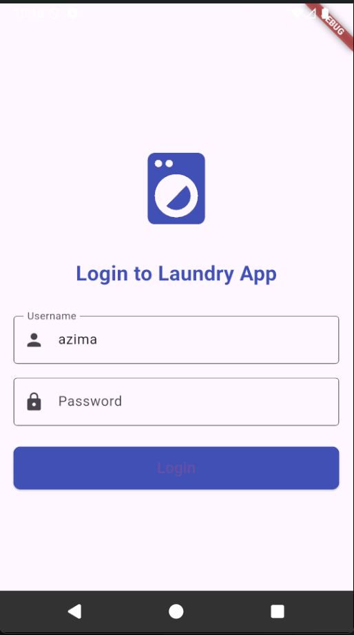
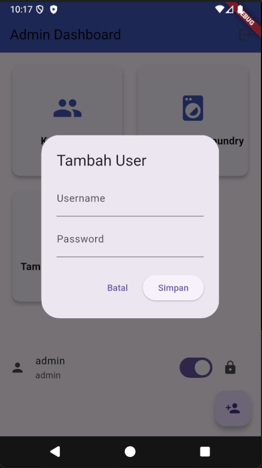
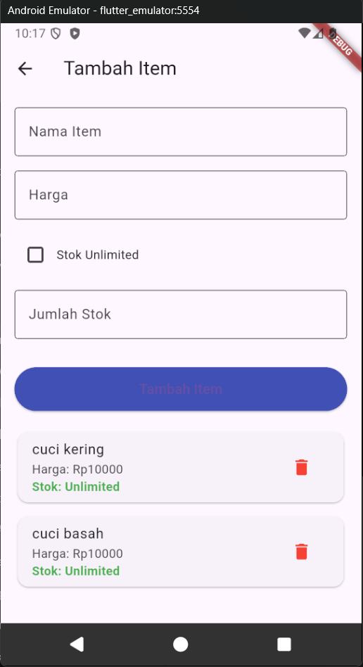
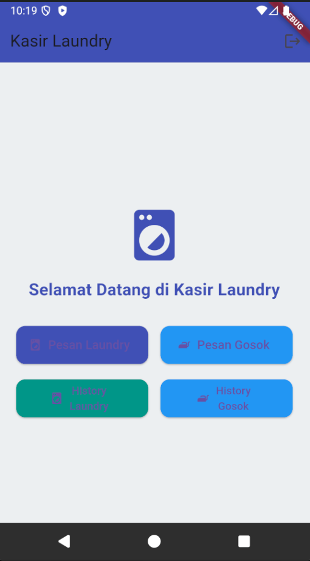

# Laundry App

A comprehensive Flutter-based laundry management application with separate interfaces for administrators and cashiers.

## Screenshots & Features

### 1. Initial Setup

<p align="center">
  
</p>

First, you register admin users to manage your application. You are free to give any name and password. This is a one-time setup that creates the primary administrator account.

---

### 2. Admin Login

<p align="center">
  
</p>

Use your admin credentials to access the admin dashboard. Both admin and cashier users can log in through this screen with their respective credentials.

---

### 3. Admin Dashboard

<p align="center">
  
</p>

The admin interface provides complete control over the laundry business operations with three main modules:

- **Kelola User**: Create and manage cashier accounts
- **Tambah Item Laundry**: Add and configure laundry service items
- **Tambah Item Gosok**: Manage dry cleaning/ironing services

The bottom section displays the current logged-in user with a toggle switch and lock icon for additional security features.

---

### 4. User Management

<p align="center">
  
</p>

Create new cashier accounts through the "Tambah User" dialog:
- Enter username for the cashier
- Set a secure password
- Click "Simpan" to save or "Batal" to cancel

Cashiers will use these credentials to access the order processing interface.

---

### 5. Item Management

<p align="center">
  
</p>

Add and configure laundry service items with flexible options:
- **Nama Item**: Enter the service name
- **Harga**: Set the price in Rupiah
- **Stok Unlimited**: Check for unlimited availability
- **Jumlah Stok**: Or enter a specific stock quantity

The list below shows all existing items (e.g., "cuci kering" and "cuci basah") with their prices and stock status. Each item has a delete button (trash icon) for easy management.

---

### 6. Cashier Home Screen

<p align="center">
  
</p>

Welcome screen for cashiers with four main action buttons:
- **Pesan Laundry**: Create new laundry orders
- **Pesan Gosok**: Create dry cleaning orders
- **History Laundry**: View laundry service history
- **History Gosok**: View dry cleaning history

Clean and intuitive interface designed for fast order processing.

---

### 7. Create New Order

<p align="center">
  
</p>

Process customer orders efficiently:
- Enter customer name in "Nama Pemesan" field
- Select items using the minus (-) and plus (+) buttons
- Available items shown with current prices (Rp10000)
- Real-time calculation displayed at the bottom:
  - **Total Items**: Shows total pieces (0 pcs)
  - **Total Harga**: Shows total price (Rp0)

---

### 8. Order History

<p align="center">
  
</p>

View comprehensive order history with search functionality:
- Search bar: "Cari berdasarkan nama atau item..."
- Each order card displays:
  - Customer name (e.g., "Antonio")
  - Order date and time (23/11/2025 10:20)
  - Number of items (2 item)
  - Item details (1x cuci kering, 1x cuci basah)
  - Total price (Rp20000)
  - Payment status: "Pending" (orange) or "Sudah Bayar" (green)

Top toolbar includes calendar, statistics, and refresh icons for additional functionality.

---

## Getting Started

### Installation

1. Clone the repository
2. Run `flutter pub get` to install dependencies
3. Run `flutter run` to launch the application

### Initial Setup

**Create Admin Account**
- On first launch, you'll see the "Setup Admin Account" screen
- Enter a username and password for the administrator
- Click "Create Admin" to complete setup

### Configuring the Application

**1. Add Laundry Items**
- Navigate to "Tambah Item Laundry" from the admin dashboard
- Enter item name (e.g., "cuci kering", "cuci basah")
- Set the price (Harga) in Rupiah
- Choose stock option: unlimited or specific quantity
- Click "Simpan Item" to save

**2. Create Cashier Accounts**
- Select "Kelola User" from the admin dashboard
- Click the floating action button (+) at the bottom
- Enter username and password for the new cashier
- Click "Simpan" to create the account

**3. Add Dry Cleaning Services**
- Access "Tambah Item Gosok" for ironing/dry cleaning services
- Configure items similar to laundry items

### Processing Orders (Cashier)

**1. Login as Cashier**
- Use cashier credentials on the login screen
- Access the "Kasir Laundry" interface

**2. Create New Order**
- Click "Pesan Laundry" or "Pesan Gosok"
- Enter customer name
- Select items using the +/- buttons
- Review total items and price
- Complete the order

**3. View Order History**
- Access "History Laundry" or "History Gosok"
- Search orders by name or item
- View complete order details and payment status

---

## Features Summary

✅ **Admin Management**
- Secure admin account setup
- User role management (Admin/Cashier)
- Item management with pricing and stock control

✅ **Order Processing**
- Quick order creation
- Real-time calculations
- Customer name tracking

✅ **History & Tracking**
- Comprehensive order history
- Search functionality
- Payment status tracking (Pending/Paid)

✅ **Multi-Service Support**
- Separate laundry and dry cleaning services
- Flexible stock management
- Easy item deletion

---

## Technical Details

- **Framework**: Flutter
- **Platform**: Android (iOS compatible)
- **Language**: Indonesian (Bahasa Indonesia)
- **Currency**: Indonesian Rupiah (Rp)

## User Roles

| Role | Access |
|------|--------|
| **Admin** | Full access to all management features, user creation, and item configuration |
| **Cashier** | Access to order processing, viewing history, and customer transactions |

---

## Notes

- All items can be deleted using the trash icon button
- Stock tracking available for inventory management
- Real-time order status updates
- Search functionality for quick order lookup
- Secure login system for both admin and cashier roles
- Toggle switch for additional security features in admin dashboard

---


## Requirements

- Flutter SDK (stable channel recommended)
- Android SDK / Android Studio (for Android development and builds)
- Optional: Xcode and macOS (for iOS builds)

Verify your environment (PowerShell):

```powershell
flutter --version
flutter doctor
```

Note: `pubspec.yaml` specifies Dart `^3.9.2`.

---

---

## Project layout (top-level)

- `lib/` — Dart source code
  - `screen/` — UI screens (login, dashboard, orders, history, etc.)
  - `database/` — local DB helper (`DatabaseHelper`) and model classes
  - `transactions/` — repository code for data access
- `android/`, `ios/`, `web/`, `windows/`, `macos/`, `linux/` — platform folders

---

## Analysis & tests

Run static analysis and tests:

```powershell
flutter analyze
flutter test
```

Resolve analyzer issues before making important commits.

---

## Troubleshooting

- If `flutter` is not recognized in PowerShell, add the SDK `bin` to your PATH temporarily:

```powershell
$env:PATH = "$env:PATH;C:\path\to\flutter\bin"
flutter --version
```

- To add Flutter to your user PATH permanently, update your Windows user environment variables or use a PowerShell snippet to append it.

---

## Data privacy

This app stores local data using `sqflite` and `shared_preferences`. Review `lib/database/` and any sample data before publishing data publicly.

---

## Publish to GitHub (example)

Create a repository on GitHub and push the project:


## License

This project includes an MIT `LICENSE` file in the repository root. Update the owner information if needed.

---

## Contact

For questions or feedback, reach out:

- Email: `azimarizki2@gmail.com`
- Instagram: `@zimm.def`
- WhatsApp: `+6289522584477`

If you want, I can run the `git` commands to commit and push this change for you (I will need the repository remote already configured). Tell me to proceed if you'd like that.

